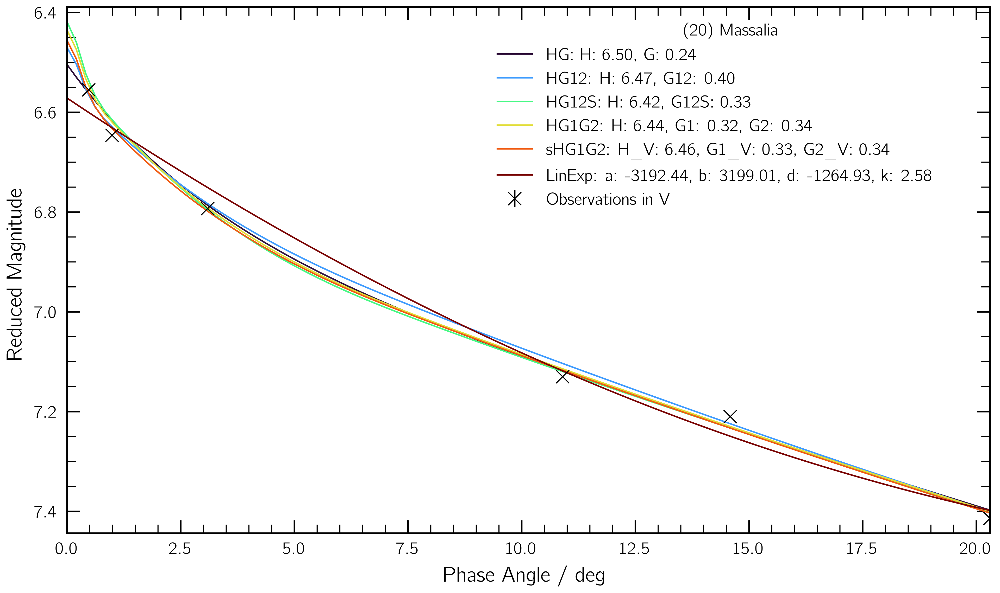
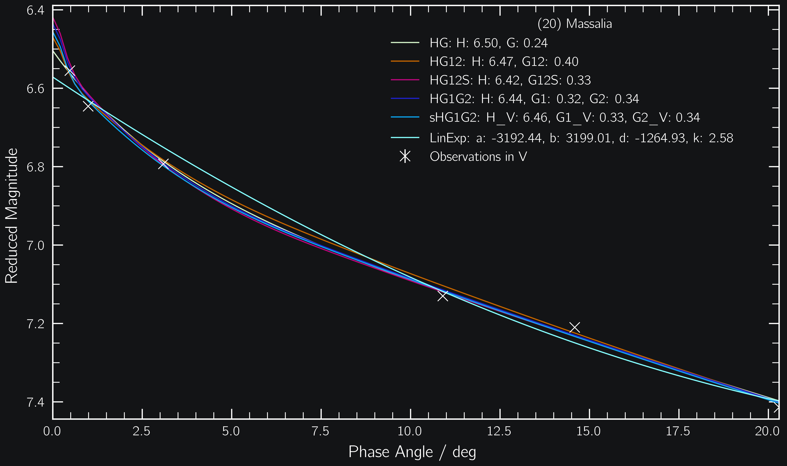

#########
``phunk``
#########

.. raw:: html

    

.. role:: gray

A ``python`` package to fit photometric phase curves of asteroids.\ [#f1]_

.. |br| raw:: html

      

.. highlight:: python

.. |br|

.. code-block:: python

   import phunk

Observe the phase curve of your favourite asteroids.

.. code-block:: python

   # Observations of (20) Massalia from Gehrels 1956
   phase = [0.57, 1.09, 3.20, 10.99, 14.69, 20.42]
   mag = [6.555, 6.646, 6.793, 7.130, 7.210, 7.414]

   epoch = [35193, 35194, 35198, 35214, 35223, 35242]

Load the observations into ``phunk``.

.. code-block:: python

   pc = phunk.PhaseCurve(phase=phase, mag=mag, epoch=epoch, target="Massalia")

Fit your favourite model(s) to the observations.

.. code-block:: python

   pc.fit(["HG", "HG1G2", "sHG1G2"])
   pc.plot()

.. toctree::
   :maxdepth: 2
   :caption: Contents
   :hidden:

   Home<self>
   Getting Started<getting_started>
   Basic Usage<core>
   Models<models>

.. rubric:: Footnotes
   :caption:

.. [#f1] Latest version: 0.1  - `What's new? <https://github.com/maxmahlke/phunk/blob/master/CHANGELOG.md>`_  | Comment, bug or feature request? `Email me <https://www.ias.universite-paris-saclay.fr/annuaire?nom=mahlke>`_ or open an issue on `GitHub <https://github.com/maxmahlke/phunk/issues>`_.
