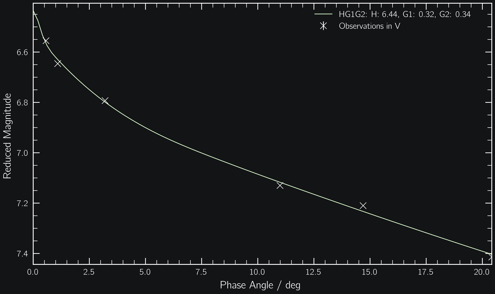

.. _models:

Photometric Models
------------------

HG
==

From `Bowell+ 1989 <https://ui.adsabs.harvard.edu/abs/1989aste.conf..524B/abstract>`_. ``phunk`` uses the model implementation from `sbpy <https://github.com/NASA-Planetary-Science/sbpy>`_.

.. code-block:: python

   import phunk

   # Observations of (20) Massalia from Gehrels 1956
   phase = [0.57, 1.09, 3.20, 10.99, 14.69, 20.42]
   mag = [6.555, 6.646, 6.793, 7.130, 7.210, 7.414]

   pc = phunk.PhaseCurve(phase=phase, mag=mag)
   pc.fit(['HG'])

   pc.plot()

HG1G2
=====

From `Muinonen+ 2010 <https://ui.adsabs.harvard.edu/abs/2010Icar..209..542M>`_. ``phunk`` uses the model implementation from `sbpy <https://github.com/NASA-Planetary-Science/sbpy>`_.

.. code-block:: python

   import phunk

   # Observations of (20) Massalia from Gehrels 1956
   phase = [0.57, 1.09, 3.20, 10.99, 14.69, 20.42]
   mag = [6.555, 6.646, 6.793, 7.130, 7.210, 7.414]

   pc = phunk.PhaseCurve(phase=phase, mag=mag)
   pc.fit(['HG1G2'])

   pc.plot()

sHG1G2
======

From `Carry+ 2024 <https://ui.adsabs.harvard.edu/abs/2024A%26A...687A..38C/abstract>`_. ``phunk`` the model implementation from `fink <https://fink-portal.org/>`_.

Note that the sHG1G2 model requires the target's ephemerides at the time of observation.
If you provide the ``target`` name and the ``epoch`` of observation, ``phunk`` queries
the ephemerides for you from the IMCCE's `Miriade <https://ssp.imcce.fr/webservices/miriade/>`_ webservice.

.. code-block:: python

   import phunk

   # Observations of (20) Massalia from Gehrels 1956
   phase = [0.57, 1.09, 3.20, 10.99, 14.69, 20.42]
   mag = [6.555, 6.646, 6.793, 7.130, 7.210, 7.414]

   epoch = [35193, 35194, 35198, 35214, 35223, 35242]  # in MJD

   pc = phunk.PhaseCurve(phase=phase, mag=mag, epoch=epoch, target=20)
   pc.fit(['sHG1G2'])

   pc.plot()

.. HG12
.. Muinonen 2010
..
.. HG12*
.. Penttilä 2016
..
..
.. Different bands
.. requires RA Dec
..
.. a+bexpc
.. Kaasalainen 2002
